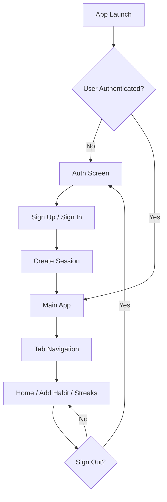

# 🎯 Habit Tracker

<div align="center">

A beautiful, feature-rich mobile habit tracking application built with React Native, Expo, and Appwrite. Track your daily habits, build streaks, and achieve your goals with an intuitive swipe-based interface.

[](https://reactnative.dev/)
[](https://expo.dev/)
[](https://www.typescriptlang.org/)
[](https://appwrite.io/)
[](LICENSE)

</div>

---

## 📱 Features

### 🔐 **User Authentication**
- Secure email and password authentication
- Session management with Appwrite
- Automatic route protection
- Persistent login state

### ✅ **Habit Management**
- **Create Habits**: Add new habits with title, description, and frequency (daily, weekly, monthly)
- **Track Habits**: Swipe right to mark habits as complete
- **Delete Habits**: Swipe left to remove habits
- **Visual Feedback**: See completed habits with opacity changes

### 🔥 **Streak Tracking**
- Real-time streak counting for each habit
- Visual fire icon indicators
- Automatic streak updates on completion
- Never lose your progress!

### 📊 **Statistics & Leaderboard**
- **Streak Leaderboard**: View all habits ranked by best streak
- **Current Streak**: Track ongoing consecutive completions
- **Best Streak**: See your all-time record for each habit
- **Total Completions**: Count lifetime habit completions

### 🎨 **Modern UI/UX**
- Beautiful Material Design with React Native Paper
- Smooth swipe gestures for actions
- Real-time updates without refreshing
- Responsive layout with safe area handling
- Intuitive tab-based navigation

### ⚡ **Real-time Updates**
- Automatic synchronization using Appwrite Realtime
- Instant updates across the app
- No manual refresh needed

---

## 🚀 Tech Stack

| Category | Technology |
|----------|-----------|
| **Framework** | [Expo](https://expo.dev) (~54.0.20) with React Native (0.81.5) |
| **Language** | TypeScript (5.9.2) |
| **UI Library** | [React Native Paper](https://callstack.github.io/react-native-paper/) (5.14.5) |
| **Navigation** | Expo Router (6.0.13) - File-based routing |
| **Gestures** | React Native Gesture Handler (2.28.0) |
| **Backend** | [Appwrite](https://appwrite.io/) (Authentication & Database) |
| **State Management** | React Context API |
| **Icons** | Expo Vector Icons with Material Community Icons |

---

## 📋 Prerequisites

Before you begin, ensure you have the following installed:

- **Node.js** (v16 or higher) - [Download](https://nodejs.org/)
- **npm** or **yarn** package manager
- **Expo CLI** - Install with `npm install -g expo-cli`
- **Appwrite Account** - [Sign up](https://appwrite.io/) and create a project

### Additional Tools (Optional)
- **Android Studio** - For Android emulator
- **Xcode** - For iOS simulator (Mac only)
- **Expo Go App** - For testing on physical devices

---

## 🛠️ Installation

### 1️⃣ Clone the Repository

```bash
git clone https://github.com/Gee-sus/habit-tracker.git
cd habit-tracker
```

### 2️⃣ Install Dependencies

```bash
npm install
```

Or with yarn:

```bash
yarn install
```

### 3️⃣ Set Up Appwrite Backend

#### Create Appwrite Project

1. Go to [Appwrite Console](https://cloud.appwrite.io/)
2. Create a new project
3. Note down your **Project ID** and **Endpoint**

#### Create Database & Collections

1. **Create Database**:
   - Go to Databases section
   - Create a new database (note the Database ID)

2. **Create "habits" Collection**:
   - Create a collection named `habits`
   - Add the following attributes:

   | Attribute | Type | Size | Required |
   |-----------|------|------|----------|
   | `user_id` | String | 255 | Yes |
   | `title` | String | 255 | Yes |
   | `description` | String | 1000 | Yes |
   | `frequency` | String | 50 | Yes |
   | `streak_count` | Integer | - | Yes |
   | `last_completed` | DateTime | - | Yes |
   | `created_at` | DateTime | - | Yes |

   - Set permissions:
     - **Create**: Users
     - **Read**: Users (user level)
     - **Update**: Users (user level)
     - **Delete**: Users (user level)

3. **Create "completions" Collection**:
   - Create a collection named `completions`
   - Add the following attributes:

   | Attribute | Type | Size | Required |
   |-----------|------|------|----------|
   | `habit_id` | String | 255 | Yes |
   | `user_id` | String | 255 | Yes |
   | `completed_at` | DateTime | - | Yes |

   - Set permissions:
     - **Create**: Users
     - **Read**: Users (user level)

#### Create Indexes (Optional but Recommended)

For better query performance:

- **habits collection**: Create index on `user_id`
- **completions collection**: Create indexes on `user_id`, `habit_id`, and `completed_at`

### 4️⃣ Configure Environment Variables

Create a `.env` file in the root directory:

```env
# Appwrite Configuration
EXPO_PUBLIC_APPWRITE_ENDPOINT=https://cloud.appwrite.io/v1
EXPO_PUBLIC_APPWRITE_PROJECT_ID=your_project_id
EXPO_PUBLIC_APPWRITE_PROJECT_NAME=habit-tracker

# Database Configuration
EXPO_PUBLIC_DB_ID=your_database_id
EXPO_PUBLIC_HABITS_COLLECTION_ID=your_habits_collection_id
EXPO_PUBLIC_COMPLETIONS_COLLECTION_ID=your_completions_collection_id
```

**Replace with your actual values from Appwrite Console.**

### 5️⃣ Start the Development Server

```bash
npx expo start
```

Or with specific options:

```bash
# Start with clearing cache
npx expo start -c

# Start for Android
npm run android

# Start for iOS
npm run ios

# Start for Web
npm run web
```

---

## 📱 Running the App

After starting the development server, you'll see a QR code and options to open the app in:

### 📲 Physical Device
- Install **Expo Go** app ([iOS](https://apps.apple.com/app/expo-go/id982107779) | [Android](https://play.google.com/store/apps/details?id=host.exp.exponent))
- Scan the QR code with your camera (iOS) or Expo Go app (Android)

### 💻 Emulator/Simulator
- Press `a` for Android emulator
- Press `i` for iOS simulator (Mac only)
- Press `w` for web browser

### 🏗️ Development Build
For a more native experience, create a [development build](https://docs.expo.dev/develop/development-builds/introduction/)

---

## 📁 Project Structure

```
habit-tracker/
│
├── app/                          # App screens (Expo Router)
│   ├── (tabs)/                   # Tab navigation group
│   │   ├── _layout.tsx          # Tab layout configuration
│   │   ├── index.tsx            # Home screen (Today's Habits)
│   │   ├── add-habit.tsx        # Create new habit screen
│   │   └── streaks.tsx          # Streak leaderboard screen
│   │
│   ├── _layout.tsx              # Root layout with auth guard
│   └── auth.tsx                 # Authentication screen
│
├── lib/                          # Utilities and configurations
│   ├── appwrite.ts              # Appwrite client setup
│   └── auth-context.tsx         # Authentication context provider
│
├── types/                        # TypeScript type definitions
│   └── database.type.ts         # Database schema types
│
├── assets/                       # Static assets
│   └── images/                  # App icons and images
│
├── .env                         # Environment variables (create this)
├── package.json                 # Dependencies
├── tsconfig.json               # TypeScript configuration
├── app.json                    # Expo configuration
└── README.md                   # This file
```

---

## 🏗️ App Architecture

### Authentication Flow



### Data Flow

1. **User Authentication**: Managed by Appwrite Auth with session persistence
2. **Data Storage**: Habits and completions stored in Appwrite Database
3. **Real-time Sync**: Appwrite Realtime subscriptions update UI instantly
4. **State Management**: React Context for auth state, local state for UI

### Key Components

- **AuthContext**: Provides authentication state and methods throughout the app
- **Route Guard**: Protects authenticated routes in `_layout.tsx`
- **Real-time Subscriptions**: Auto-updates habits and completions
- **Swipeable Cards**: Gesture-based UI for completing/deleting habits

---

## 🎯 Usage Guide

### Creating Your First Habit

1. Launch the app and sign in/sign up
2. Navigate to the **Add Habit** tab (➕ icon)
3. Fill in the habit details:
   - **Title**: Name your habit (e.g., "Morning Exercise")
   - **Description**: Add details (e.g., "30 min workout")
   - **Frequency**: Choose daily, weekly, or monthly
4. Tap **Add Habit**
5. Your habit appears on the Home screen!

### Tracking Habits

1. Go to the **Home** tab
2. **Swipe right** on a habit to mark it complete ✅
3. **Swipe left** on a habit to delete it 🗑️
4. See your streak update in real-time! 🔥

### Viewing Streaks

1. Navigate to the **Streaks** tab (🏆 icon)
2. View all habits ranked by best streak
3. See stats for each habit:
   - **Current Streak**: Ongoing consecutive days
   - **Best Streak**: All-time record
   - **Total Completions**: Lifetime count

---

## 🔐 Security & Privacy

- All user data is securely stored in Appwrite
- Authentication uses industry-standard security practices
- User data is isolated per account
- No data is shared with third parties

---

## 🚀 Building for Production

### Android

```bash
# Create production build
eas build --platform android

# Or create APK for testing
eas build --platform android --profile preview
```

### iOS

```bash
# Create production build
eas build --platform ios
```

**Note**: You need to set up [EAS Build](https://docs.expo.dev/build/setup/) first.

---

## 🧪 Testing

```bash
# Run linter
npm run lint

# Type checking
npx tsc --noEmit
```

---

## 🤝 Contributing

Contributions are welcome! Here's how you can help:

1. **Fork the repository**
2. **Create a feature branch**: `git checkout -b feature/amazing-feature`
3. **Commit your changes**: `git commit -m 'Add amazing feature'`
4. **Push to the branch**: `git push origin feature/amazing-feature`
5. **Open a Pull Request**

### Contribution Guidelines

- Follow the existing code style
- Write meaningful commit messages
- Update documentation as needed
- Test your changes thoroughly

---

## 🐛 Known Issues & Roadmap

### Current Issues
- None reported yet!

### Future Enhancements
- 📅 Calendar view for habit history
- 📈 Advanced analytics and insights
- 🎨 Theme customization
- 🔔 Push notifications and reminders
- 🌐 Social features (share achievements)
- 📊 Weekly/monthly progress reports
- 🏅 Achievement badges
- ☁️ Data export/import

---

## 📄 License

This project is licensed under the MIT License - see the [LICENSE](LICENSE) file for details.

---

## 👨‍💻 Author

**Created by [Gee-sus](https://github.com/Gee-sus)**

- GitHub: [@Gee-sus](https://github.com/Gee-sus)
- Project Link: [habit-tracker](https://github.com/Gee-sus/habit-tracker)

---

## 🙏 Acknowledgments

- [Expo](https://expo.dev/) - Amazing React Native framework
- [Appwrite](https://appwrite.io/) - Powerful open-source backend
- [React Native Paper](https://callstack.github.io/react-native-paper/) - Beautiful Material Design components
- All contributors and users of this app!

---

## 🔗 Useful Links

- **Documentation**
  - [Expo Documentation](https://docs.expo.dev/)
  - [Appwrite Documentation](https://appwrite.io/docs)
  - [React Native Paper Docs](https://callstack.github.io/react-native-paper/)
  - [Expo Router Guide](https://docs.expo.dev/router/introduction/)

- **Community**
  - [Expo Discord](https://chat.expo.dev/)
  - [Appwrite Discord](https://appwrite.io/discord)
  - [React Native Community](https://reactnative.dev/community/overview)

---

<div align="center">

### ⭐ Star this repo if you find it helpful!

Made with ❤️ and ☕

</div>
